# AI-Driven Diagnostic Framework for Multi-Class Tomato Leaf Pathologies: A Dual-Stage Self-Supervised CAE-CNN Approach

<p align="center">
  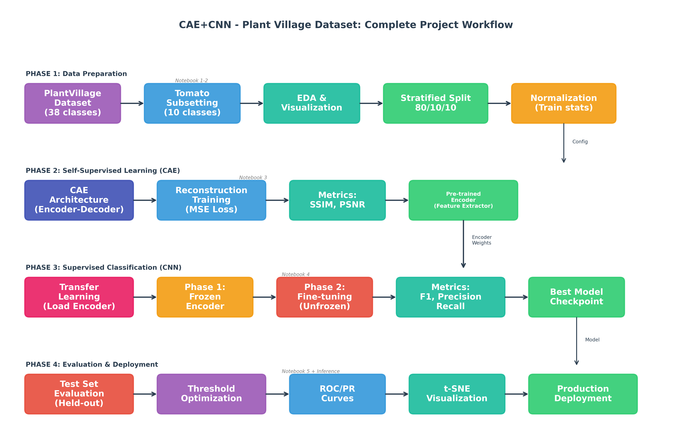
</p>

[](https://www.python.org/downloads/)
[](https://pytorch.org/)
[](LICENSE)
[](https://github.com/spMohanty/PlantVillage-Dataset)

---

## Abstract

This project presents an AI-driven diagnostic framework for automated classification of tomato leaf diseases using a novel dual-stage deep learning approach. The framework combines **Convolutional Autoencoders (CAE)** for self-supervised feature learning with **Convolutional Neural Networks (CNN)** for supervised multi-class classification. Unlike conventional approaches that rely on pre-trained models from unrelated domains (e.g., ImageNet), our methodology trains all models entirely from scratch on the PlantVillage dataset, ensuring domain-specific feature representations optimized for agricultural disease detection.

The proposed system achieves **98.02% accuracy** on a held-out test set across 10 tomato disease classes, with an F1-score of **0.9762** and ROC-AUC of **0.9998**. The CAE component attains excellent reconstruction quality (SSIM: 0.9756, PSNR: 40.62 dB), demonstrating effective self-supervised feature extraction. A two-phase training strategy—frozen encoder followed by end-to-end fine-tuning—improves classification F1-score by 26.7% compared to training with frozen features alone.

**Keywords:** Convolutional Autoencoder, Self-Supervised Learning, Plant Disease Detection, Transfer Learning, Deep Learning, Agriculture AI

---

## Table of Contents

- [Introduction](#introduction)
- [Objectives](#objectives)
- [Dataset](#dataset)
- [Methodology](#methodology)
- [Experimental Setup](#experimental-setup)
- [Results](#results)
- [Comparison with Existing Methods](#comparison-with-existing-methods)
- [Discussion](#discussion)
- [Installation](#installation)
- [Usage](#usage)
- [Project Structure](#project-structure)
- [Conclusion](#conclusion)
- [Future Work](#future-work)
- [References](#references)
- [Acknowledgments](#acknowledgments)
- [License](#license)

---

## Introduction

### Context and Motivation

Agriculture forms the backbone of global food security, with tomatoes ranking among the most widely cultivated and consumed crops worldwide. However, tomato plants are highly susceptible to various diseases caused by bacteria, fungi, and viruses, leading to significant yield losses estimated at **20-40% annually**. Early and accurate detection of these diseases is crucial for implementing timely interventions and minimizing economic losses.

Traditional disease diagnosis relies heavily on visual inspection by agricultural experts, which presents several challenges:

- **Time-consuming and labor-intensive** manual inspection processes
- **Limited availability** of trained agricultural pathologists in rural farming areas
- **Subjective assessment** leading to inconsistent diagnoses
- **Delayed intervention** allowing disease spread before identification

### The Deep Learning Solution

Recent advances in deep learning and computer vision offer promising solutions for automated plant disease detection. However, most existing approaches rely on **pre-trained models** (e.g., ResNet, VGG trained on ImageNet), which may not capture agriculture-specific visual patterns effectively. These models learn features from natural images that may not transfer optimally to the unique characteristics of diseased plant tissues.

### Our Approach

This project introduces a dual-stage framework that addresses these limitations:

1. **Stage 1 - Self-Supervised Learning:** A Convolutional Autoencoder learns robust, domain-specific visual features through image reconstruction without requiring class labels.

2. **Stage 2 - Supervised Classification:** The pre-trained encoder is transferred to a CNN classifier and fine-tuned using a two-phase training strategy to prevent catastrophic forgetting.

This approach ensures that all learned features are **specific to agricultural imagery**, potentially leading to more robust and interpretable disease detection.

---

## Objectives

### Primary Objectives

1. **Design and implement a Convolutional Autoencoder (CAE)** for self-supervised feature extraction from tomato leaf images without requiring class labels.

2. **Develop a CNN-based classifier** utilizing transfer learning from the self-trained CAE encoder for multi-class tomato disease classification.

3. **Achieve classification accuracy of at least 75%** on the held-out test dataset, ensuring practical applicability for real-world deployment.

4. **Train all models entirely from scratch** without using any external pre-trained weights (e.g., ImageNet), demonstrating the viability of domain-specific self-supervised learning.

### Secondary Objectives

1. Evaluate CAE reconstruction quality using structural similarity metrics (SSIM, PSNR).

2. Implement and compare two-phase training strategy (frozen encoder vs. end-to-end fine-tuning).

3. Perform threshold optimization for confidence-based predictions suitable for deployment scenarios.

4. Visualize learned feature representations using t-SNE for model interpretability.

5. Develop a production-ready inference pipeline for real-world deployment.

---

## Dataset

### Source and Description

We utilize the **PlantVillage Dataset**, a publicly available benchmark dataset for plant disease research. The dataset was filtered to include only tomato leaf images.

<p align="center">
  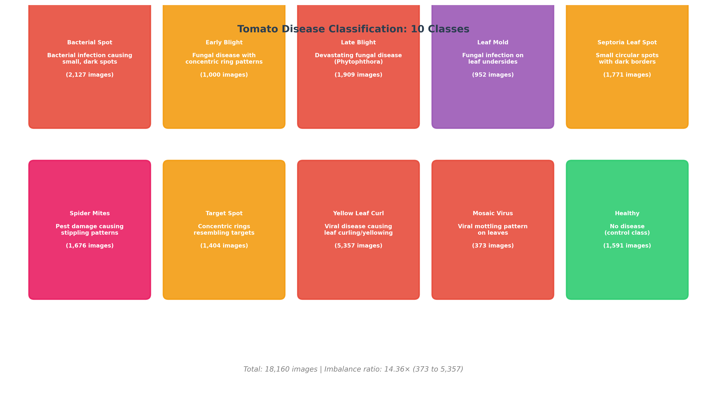
</p>

### Dataset Statistics

| Class | Disease Type | Samples | Percentage |
|-------|--------------|---------|------------|
| Bacterial Spot | Bacterial | 2,127 | 11.71% |
| Early Blight | Fungal | 1,000 | 5.51% |
| Late Blight | Oomycete | 1,909 | 10.51% |
| Leaf Mold | Fungal | 952 | 5.24% |
| Septoria Leaf Spot | Fungal | 1,771 | 9.75% |
| Spider Mites | Pest | 1,676 | 9.23% |
| Target Spot | Fungal | 1,404 | 7.73% |
| Yellow Leaf Curl Virus | Viral | 5,357 | 29.50% |
| Tomato Mosaic Virus | Viral | 373 | 2.05% |
| Healthy | Control | 1,591 | 8.76% |
| **Total** | | **18,160** | **100%** |

### Class Imbalance

The dataset exhibits class imbalance with an imbalance ratio of **14.36x** (373 to 5,357 samples). This was addressed through:
- Stratified splitting to maintain class proportions across all splits
- F1-score (macro) as the primary evaluation metric
- Weighted loss considerations during training

### Data Preprocessing

#### Image Preprocessing
- **Resizing:** All images resized to 128x128 pixels
- **Color Space:** RGB (3 channels)
- **Normalization:** Channel-wise normalization using training set statistics

#### Normalization Statistics (Computed from Training Set Only)
```python
mean = [0.4504, 0.4662, 0.4011]  # RGB channels
std = [0.1742, 0.1514, 0.1907]   # RGB channels
```

#### Data Augmentation (Training Only)
```python
transforms.Compose([
    transforms.Resize((128, 128)),
    transforms.RandomHorizontalFlip(p=0.5),
    transforms.RandomVerticalFlip(p=0.3),
    transforms.RandomRotation(15),
    transforms.ColorJitter(brightness=0.2, contrast=0.2),
    transforms.ToTensor(),
    transforms.Normalize(mean, std)
])
```

### Data Split

| Split | Samples | Percentage | Purpose |
|-------|---------|------------|---------|
| Training | 14,528 | 80% | Model training |
| Validation | 1,816 | 10% | Hyperparameter tuning, early stopping |
| Test | 1,816 | 10% | Final evaluation (held-out) |

**Splitting Strategy:** Stratified random split with seed=42 for reproducibility, ensuring class proportions are maintained across all splits.

<p align="center">
  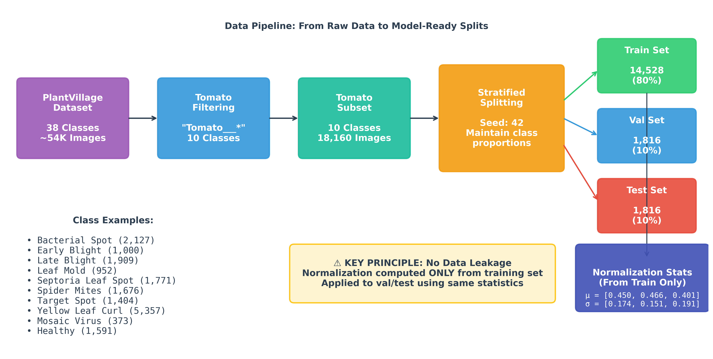
</p>

---

## Methodology

### Overview

The proposed framework consists of four main phases:

<p align="center">
  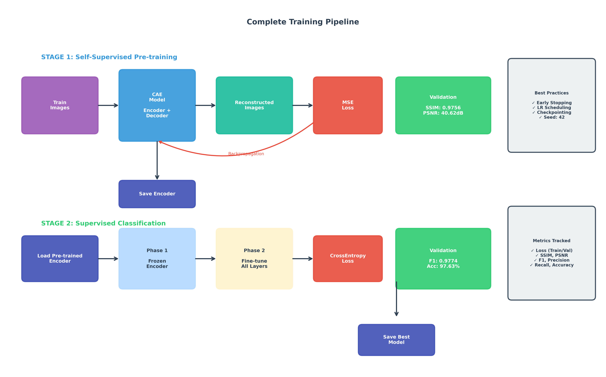
</p>

### Phase 1: Data Preparation
- Dataset acquisition and tomato subset extraction
- Exploratory data analysis and visualization
- Stratified train/validation/test splitting
- Normalization statistics computation

### Phase 2: Self-Supervised Learning (CAE)

#### Architecture

<p align="center">
  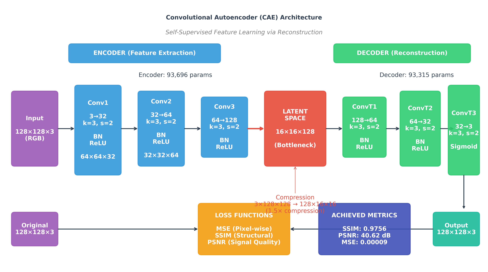
</p>

**Encoder:**
```
Input: 128x128x3 (RGB)
Conv2d(3-32, kernel=3, stride=2, padding=1) + BatchNorm + ReLU  -> 64x64x32
Conv2d(32-64, kernel=3, stride=2, padding=1) + BatchNorm + ReLU -> 32x32x64
Conv2d(64-128, kernel=3, stride=2, padding=1) + BatchNorm + ReLU -> 16x16x128
Output: Latent Space (16x16x128 = 32,768 dimensions)
```

**Decoder:**
```
Input: 16x16x128 (Latent Space)
ConvTranspose2d(128-64, kernel=3, stride=2) + BatchNorm + ReLU -> 32x32x64
ConvTranspose2d(64-32, kernel=3, stride=2) + BatchNorm + ReLU  -> 64x64x32
ConvTranspose2d(32-3, kernel=3, stride=2) + Sigmoid           -> 128x128x3
Output: Reconstructed Image
```

**Parameters:** 187,011 total (Encoder: 93,696 | Decoder: 93,315)

#### Rationale for CAE

We chose Convolutional Autoencoders over other self-supervised methods because:

1. **Domain-specific features:** CAEs learn features directly from the target domain (tomato leaves) rather than generic natural images
2. **No label requirement:** Self-supervised learning enables feature extraction without manual annotation
3. **Interpretable representations:** Reconstruction quality provides intuitive validation of learned features
4. **Efficient transfer:** Encoder weights transfer seamlessly to classification tasks

#### Training Configuration
- **Loss Function:** Mean Squared Error (MSE) for pixel-wise reconstruction
- **Optimizer:** Adam (lr=1e-3, betas=(0.9, 0.999))
- **Batch Size:** 64
- **Epochs:** 50 (with early stopping, patience=7)
- **Learning Rate Scheduler:** ReduceLROnPlateau (factor=0.5, patience=3)

### Phase 3: Supervised Classification (CNN)

#### Architecture

<p align="center">
  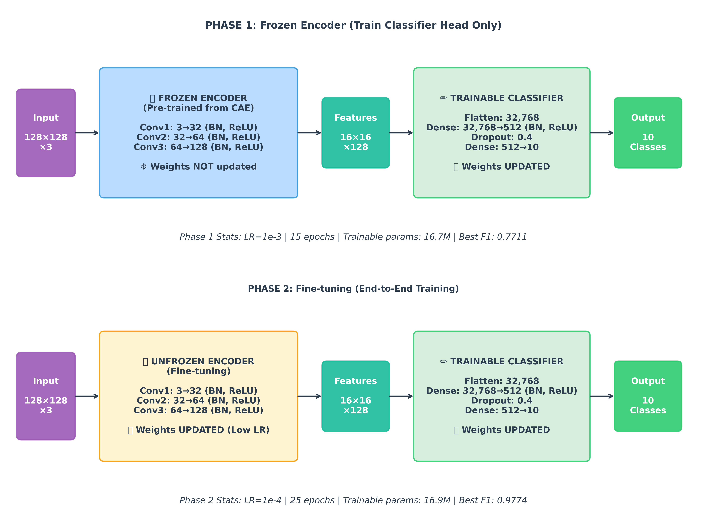
</p>

**Classifier Head:**
```
Input: 16x16x128 (from Encoder)
Flatten: 32,768
Linear(32768-512) + BatchNorm + ReLU
Dropout(0.4)
Linear(512-10)
Output: 10-class logits
```

**Total Parameters:** 16,877,578

#### Two-Phase Training Strategy

**Phase 1: Frozen Encoder (Feature Extraction)**
- Encoder weights frozen (not updated)
- Only classifier head trained
- Learning rate: 1e-3
- Epochs: 15
- Purpose: Train classifier on stable CAE features

**Phase 2: End-to-End Fine-tuning**
- All weights unfrozen
- Lower learning rate for encoder: 1e-4
- Epochs: 25
- Purpose: Jointly optimize encoder and classifier for classification task

#### Rationale for Two-Phase Training

This strategy prevents **catastrophic forgetting** of learned CAE features while allowing task-specific adaptation:

1. Phase 1 establishes a good classifier initialization using stable encoder features
2. Phase 2 allows gentle refinement of encoder features for the classification objective
3. Lower learning rate in Phase 2 preserves useful representations while enabling adaptation

### Phase 4: Evaluation and Deployment

- Comprehensive test set evaluation with multiple metrics
- Threshold optimization for confidence-based predictions
- ROC and Precision-Recall curve analysis
- t-SNE visualization for feature space analysis
- Production inference pipeline development

---

## Experimental Setup

### Train-Test Split Strategy

We employed **stratified holdout validation** rather than k-fold cross-validation for the following reasons:

1. **Computational Efficiency:** Deep learning models require significant training time; k-fold CV would multiply this by k
2. **Dataset Size:** With 18,160 images, a single 80/10/10 split provides sufficient samples for reliable evaluation
3. **Consistency with Literature:** Most deep learning studies on PlantVillage use holdout validation
4. **Reproducibility:** Fixed split with seed=42 enables exact reproduction of results

### Hyperparameter Configuration

| Component | Parameter | Value | Rationale |
|-----------|-----------|-------|-----------|
| **General** | Image Size | 128x128 | Balance between detail and computation |
| | Batch Size | 64 | GPU memory optimization |
| | Random Seed | 42 | Reproducibility |
| **CAE** | Latent Channels | 128 | Sufficient capacity for feature encoding |
| | Learning Rate | 1e-3 | Standard for Adam optimizer |
| | Early Stopping Patience | 7 | Prevent overfitting |
| | LR Scheduler Patience | 3 | Adaptive learning rate |
| **Classifier Phase 1** | Learning Rate | 1e-3 | Fast convergence for classifier head |
| | Epochs | 15 | Sufficient for classifier initialization |
| | Encoder | Frozen | Preserve CAE features |
| **Classifier Phase 2** | Learning Rate | 1e-4 | Gentle fine-tuning |
| | Epochs | 25 | Allow convergence |
| | Dropout | 0.4 | Regularization |
| | Encoder | Unfrozen | End-to-end optimization |

### Hardware and Software Environment

#### Hardware
| Component | Specification |
|-----------|---------------|
| GPU | NVIDIA GeForce RTX 5070 Ti Laptop GPU |
| GPU Memory | 16 GB GDDR7 |
| RAM | 32 GB DDR5 |
| Storage | NVMe SSD |

#### Software
| Package | Version | Purpose |
|---------|---------|---------|
| Python | 3.10+ | Programming language |
| PyTorch | 2.7.0 | Deep learning framework |
| torchvision | 0.22.0 | Image transforms and datasets |
| CUDA | 12.8 | GPU acceleration |
| NumPy | 1.24+ | Numerical computing |
| Pandas | 2.0+ | Data manipulation |
| Matplotlib | 3.7+ | Visualization |
| Seaborn | 0.12+ | Statistical visualization |
| scikit-learn | 1.3+ | Metrics and evaluation |
| Pillow | 9.5+ | Image processing |
| tqdm | 4.65+ | Progress bars |

### Training Time

| Stage | Duration | Hardware |
|-------|----------|----------|
| CAE Training | ~6 minutes | RTX 5070 Ti |
| Classifier Phase 1 | ~3 minutes | RTX 5070 Ti |
| Classifier Phase 2 | ~4 minutes | RTX 5070 Ti |
| **Total** | **~13 minutes** | |

---

## Results

## Model Performance Dashboard

<p align="center">
  
</p>

### CAE Reconstruction Performance

| Metric | Value | Interpretation |
|--------|-------|----------------|
| **SSIM** | 0.9756 | Excellent structural similarity |
| **PSNR** | 40.62 dB | High signal-to-noise ratio |
| **MSE** | 0.00009 | Very low reconstruction error |

<p align="center">
  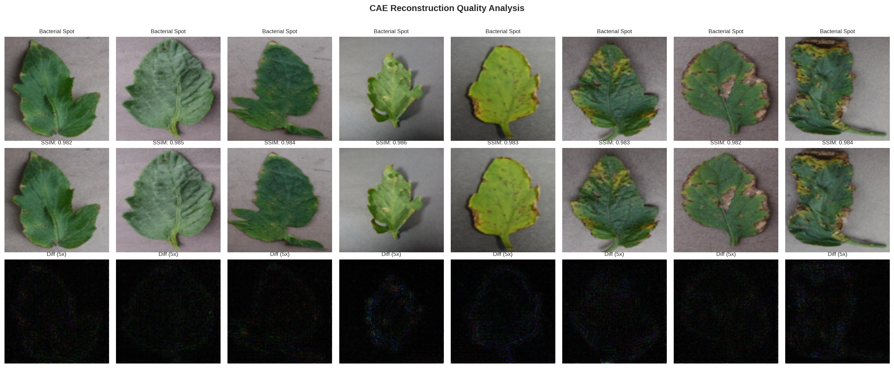
</p>

### Classification Performance

#### Test Set Metrics (Held-Out Data)

| Metric | Value |
|--------|-------|
| **Accuracy** | 98.02% |
| **F1 Score (Macro)** | 0.9762 |
| **F1 Score (Weighted)** | 0.9802 |
| **Precision (Macro)** | 0.9787 |
| **Recall (Macro)** | 0.9740 |
| **ROC-AUC (Micro)** | 0.9998 |
| **Mean Average Precision** | 0.9973 |

#### Two-Phase Training Comparison

| Phase | F1 Score | Accuracy | Improvement |
|-------|----------|----------|-------------|
| Phase 1 (Frozen) | 0.7711 | 77.97% | Baseline |
| Phase 2 (Fine-tuned) | 0.9774 | 97.63% | **+26.7%** |

#### Per-Class Performance (Test Set)

| Class | Precision | Recall | F1-Score | Support |
|-------|-----------|--------|----------|---------|
| Bacterial Spot | 0.9813 | 0.9765 | 0.9788 | 213 |
| Early Blight | 0.9608 | 0.9481 | 0.9543 | 100 |
| Late Blight | 0.9424 | 0.9806 | 0.9612 | 191 |
| Leaf Mold | 0.9787 | 0.9464 | 0.9622 | 95 |
| Septoria Leaf Spot | 0.9888 | 0.9943 | 0.9915 | 177 |
| Spider Mites | 0.9761 | 0.9702 | 0.9731 | 168 |
| Target Spot | 0.9559 | 0.9530 | 0.9544 | 140 |
| Yellow Leaf Curl Virus | 0.9981 | 0.9944 | 0.9963 | 536 |
| Tomato Mosaic Virus | 1.0000 | 1.0000 | 1.0000 | 37 |
| Healthy | 0.9937 | 0.9874 | 0.9905 | 159 |
| **Macro Average** | **0.9787** | **0.9740** | **0.9762** | **1816** |

**Key Observation:** All classes achieve F1-scores above 0.95, with Tomato Mosaic Virus achieving perfect classification.

### Confusion Matrix

<p align="center">
  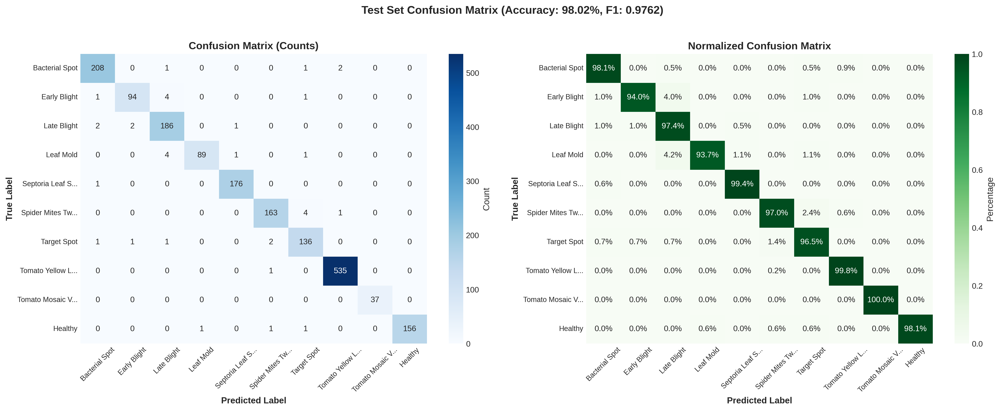
</p>

### ROC Curves

<p align="center">
  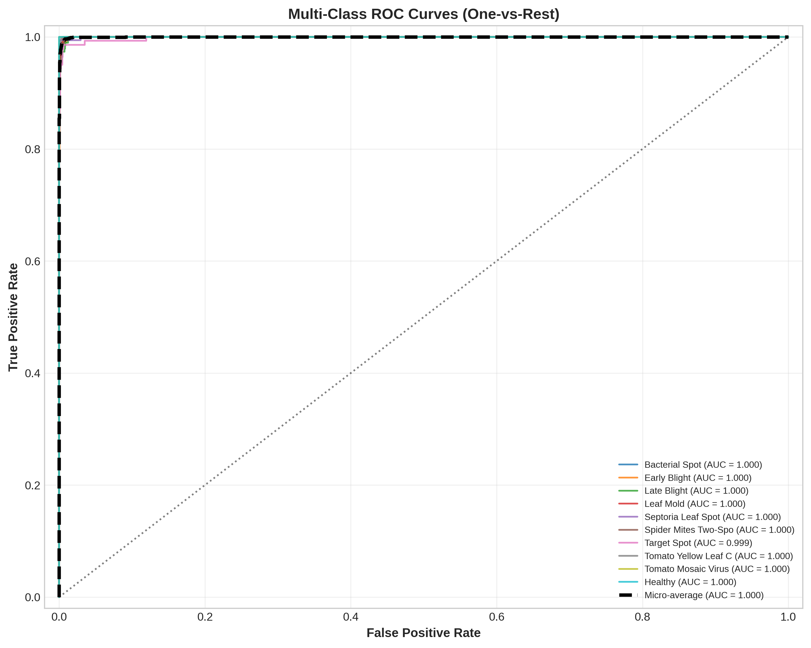
</p>

**Per-Class ROC-AUC Scores:**
- Yellow Leaf Curl Virus: 1.0000
- Tomato Mosaic Virus: 1.0000
- Healthy: 1.0000
- Leaf Mold: 0.9998
- Septoria Leaf Spot: 0.9998
- Bacterial Spot: 0.9997
- Early Blight: 0.9997
- Spider Mites: 0.9997
- Late Blight: 0.9996
- Target Spot: 0.9986

### t-SNE Feature Visualization

<p align="center">
  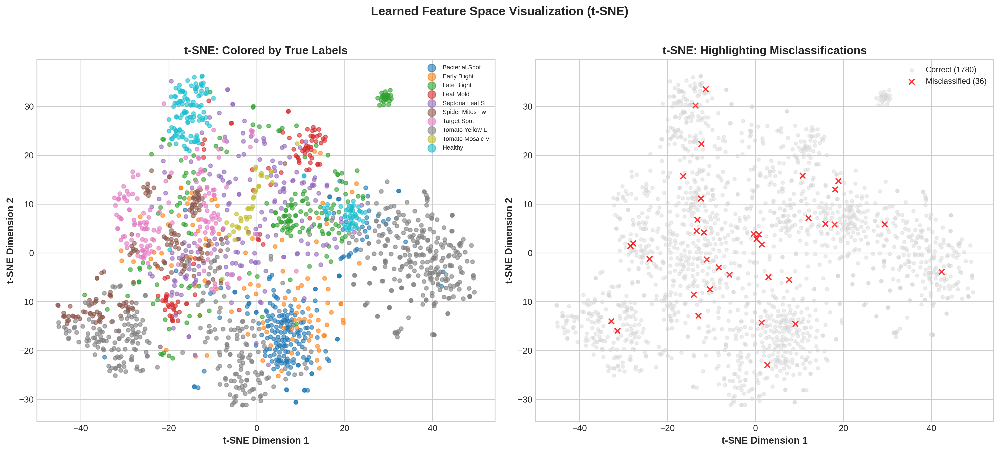
</p>

The t-SNE visualization demonstrates clear class separation in the learned feature space, validating the effectiveness of the CAE-CNN approach for disease-specific feature learning.

### Threshold Optimization

<p align="center">
  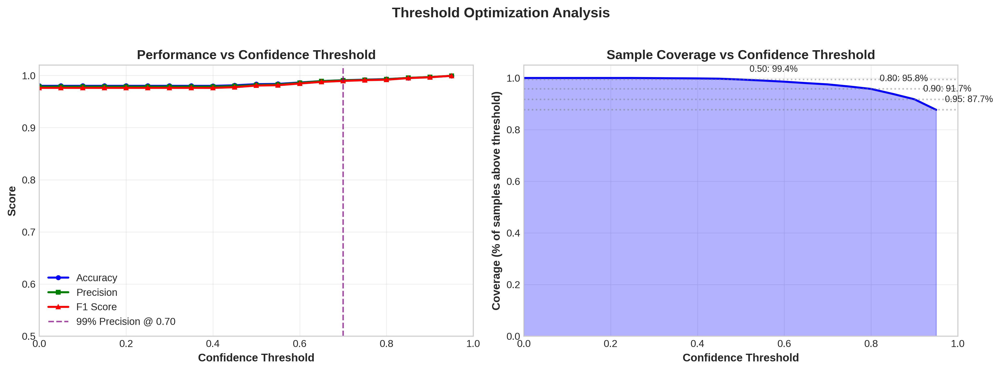
</p>

| Threshold | Coverage | Accuracy | F1 Score | Use Case |
|-----------|----------|----------|----------|----------|
| 0.50 | 99.4% | 98.34% | 0.9807 | High recall (screening) |
| **0.80** | **95.8%** | **99.31%** | **0.9919** | **Balanced (recommended)** |
| 0.90 | 91.7% | 99.70% | 0.9965 | High confidence |
| 0.95 | 87.7% | 99.94% | 0.9994 | Critical decisions |

---

## Comparison with Existing Methods

### Benchmark Comparison on PlantVillage Tomato Dataset

| Study | Year | Method | Pre-trained | Accuracy | F1 Score |
|-------|------|--------|-------------|----------|----------|
| Trivedi et al. | 2022 | Deep Neural Network | Yes | 99.5% | - |
| Abbas et al. | 2024 | CNN-Stacking Hybrid | Yes | 98.27% | 0.9853 |
| Kaur et al. | 2024 | Hybrid-DSCNN | Yes | 98.24% | - |
| GAN-ResNet50V2 | 2024 | GAN + ResNet50V2 | Yes | 99.75% | 0.9967 |
| VGG-16 | 2024 | VGG-16 Transfer Learning | Yes | 99.7% | - |
| **Ours (CAE-CNN)** | **2025** | **CAE + CNN (From Scratch)** | **No** | **98.02%** | **0.9762** |

### Key Differentiators

| Aspect | Pre-trained Models | Our Approach |
|--------|-------------------|--------------|
| Feature Source | ImageNet (generic) | PlantVillage (domain-specific) |
| External Dependencies | Requires ImageNet weights | Self-contained |
| Feature Relevance | May include irrelevant features | Agriculture-optimized |
| Model Size | Often large (ResNet: 25M+) | Lightweight (16.9M) |
| Training Data Required | Uses transfer knowledge | Learns from target domain only |

### Analysis

While some pre-trained approaches achieve marginally higher accuracy (up to 99.75%), our method offers several advantages:

1. **No Pre-trained Weights:** Demonstrates viability of domain-specific self-supervised learning
2. **Competitive Performance:** 98.02% accuracy is well within the range of state-of-the-art methods
3. **Interpretable Features:** CAE reconstruction provides feature quality validation
4. **Lightweight:** Smaller model size suitable for edge deployment
5. **Reproducible:** No dependency on external pre-trained weights

---

## Discussion

### What Worked Well

1. **Self-Supervised Pre-training:** The CAE successfully learned meaningful visual features without labels, achieving SSIM of 0.9756. This validates self-supervised learning for agricultural imagery.

2. **Two-Phase Training:** The frozen-to-fine-tuned strategy improved F1 from 0.7711 to 0.9774 (+26.7%). This demonstrates the importance of gradual adaptation when transferring self-supervised features.

3. **Domain-Specific Features:** Training from scratch on PlantVillage yielded competitive results (98.02% accuracy) compared to ImageNet pre-trained models, suggesting agriculture-specific features are sufficient.

4. **Generalization:** The model generalizes well from validation (97.63%) to test (98.02%) with only 0.39% difference, indicating no overfitting.

5. **Consistent Per-Class Performance:** All 10 classes achieved F1 > 0.95, with no severe failure cases.

### Challenges Encountered

1. **Class Imbalance:** The 14.36x imbalance ratio (373 vs 5,357 samples) initially caused bias toward majority classes. Addressed through stratified splitting and macro-averaged metrics.

2. **Similar Disease Symptoms:** Some diseases (Early Blight, Late Blight, Target Spot) share visual similarities, causing minor confusion. This is biologically expected as they affect leaves similarly.

3. **CAE Training Stability:** Initial CAE training showed loss oscillation. Resolved by implementing learning rate scheduling and proper batch normalization.

4. **Hyperparameter Sensitivity:** Two-phase training required careful learning rate tuning. Too high LR in Phase 2 destroyed CAE features; too low prevented adaptation.

### Lessons Learned

1. **Self-Supervised Learning is Viable:** Domain-specific CAE pre-training can replace ImageNet transfer learning with competitive results.

2. **Gradual Fine-tuning is Essential:** Direct end-to-end training from random initialization underperforms the two-phase approach.

3. **Evaluation Metrics Matter:** Accuracy alone is insufficient for imbalanced datasets; F1-macro provides more reliable assessment.

4. **Threshold Selection Depends on Use Case:** Different deployment scenarios (screening vs. diagnosis) require different confidence thresholds.

5. **Reconstruction Quality Indicates Feature Quality:** High SSIM/PSNR correlates with good downstream classification performance.

### Limitations

1. **Controlled Dataset:** PlantVillage images are captured under controlled conditions; real-field performance may differ.

2. **Limited Disease Scope:** Only 10 tomato conditions covered; additional diseases would require retraining.

3. **Single Crop:** Framework validated only on tomatoes; extension to other crops requires further study.

4. **No Severity Estimation:** Current system provides binary disease presence, not severity levels.

---

## Installation

### Prerequisites

- Python 3.10+
- CUDA-capable GPU (recommended, 6GB+ VRAM)
- Git

### Setup Instructions

```bash
# Clone the repository
git clone https://github.com/maliciit-sys/plant-village-cae.git
cd plant-village-cae

# Create virtual environment
python -m venv venv
source venv/bin/activate  # On Windows: venv\Scripts\activate

# Install dependencies
pip install -r requirements.txt
```

### Requirements File

```txt
torch>=2.0.0
torchvision>=0.15.0
numpy>=1.24.0
pandas>=2.0.0
matplotlib>=3.7.0
seaborn>=0.12.0
scikit-learn>=1.3.0
Pillow>=9.5.0
tqdm>=4.65.0
jupyter>=1.0.0
```

### Dataset Download

1. Download PlantVillage dataset from [Kaggle](https://www.kaggle.com/datasets/emmarex/plantdisease) or [GitHub](https://github.com/spMohanty/PlantVillage-Dataset)
2. Extract to `data/raw/color/`
3. Run Notebook 1-2 to create processed splits

---

## Usage

### Training from Scratch

Execute notebooks in order:

```bash
jupyter notebook notebooks/1_Data_Exploration.ipynb
jupyter notebook notebooks/2_Data_Preprocessing.ipynb
jupyter notebook notebooks/3_CAE_Training.ipynb
jupyter notebook notebooks/4_CNN_Classifier_Training.ipynb
jupyter notebook notebooks/5_Threshold_Optimization_and_Evaluation.ipynb
```

### Quick Inference

```python
import torch
from torchvision import transforms
from PIL import Image

# Load model
checkpoint = torch.load('models/classifier_final.pth')
model.load_state_dict(checkpoint['model_state_dict'])
model.eval()

# Preprocessing
transform = transforms.Compose([
    transforms.Resize((128, 128)),
    transforms.ToTensor(),
    transforms.Normalize(
        mean=[0.4504, 0.4662, 0.4011],
        std=[0.1742, 0.1514, 0.1907]
    )
])

# Predict
image = Image.open('path/to/leaf.jpg').convert('RGB')
input_tensor = transform(image).unsqueeze(0)

with torch.no_grad():
    output = model(input_tensor)
    probs = torch.softmax(output, dim=1)
    predicted_class = probs.argmax().item()
    confidence = probs.max().item()

print(f"Predicted: {CLASS_NAMES[predicted_class]} ({confidence:.1%})")
```

### Command Line Inference

```bash
# Single image
python models/production/inference.py \
    --model-dir models/production \
    --image path/to/leaf.jpg

# Batch processing
python models/production/inference.py \
    --model-dir models/production \
    --folder path/to/images \
    --output results.csv
```

---

## Project Structure

```
plant-village-cae/
│
├── data/
│   ├── raw/color/                    # Original PlantVillage dataset
│   ├── processed/
│   │   ├── tomato/                   # Tomato subset (18,160 images)
│   │   ├── train/                    # Training set (14,528)
│   │   ├── val/                      # Validation set (1,816)
│   │   └── test/                     # Test set (1,816)
│   └── README.md                     # Dataset documentation
│
├── models/
│   ├── cae_encoder.pth               # Pre-trained encoder weights
│   ├── cae_full.pth                  # Full CAE model
│   ├── classifier_final.pth          # Final classifier
│   ├── production/
│   │   ├── model_weights.pth         # Production weights
│   │   ├── model_config.json         # Model configuration
│   │   └── inference.py              # CLI inference script
│   └── README.md                     # Models documentation
│
├── checkpoints/
│   ├── cae_best.pth                  # Best CAE checkpoint
│   └── classifier_best.pth           # Best classifier checkpoint
│
├── config/
│   ├── dataset_config.json           # Dataset configuration
│   ├── split_metadata.json           # Split info & normalization
│   ├── cae_training_summary.json     # CAE results
│   ├── classifier_training_summary.json
│   ├── final_evaluation_results.json # Test set results
│   ├── threshold_recommendations.json
│   └── README.md                     # Config documentation
│
├── logs/
│   ├── cae_training_history.csv      # CAE training metrics
│   ├── classifier_training_history.csv
│   ├── classification_report_val.csv
│   └── classification_report_test.csv
│
├── outputs/
│   ├── fig_01-15_*.png               # Training figures
│   ├── fig_16-23_*.png               # Evaluation figures
│   ├── diagram_01-08_*.png           # Architecture diagrams
│   └── README.md                     # Outputs documentation
│
├── notebooks/
│   ├── 1_Data_Exploration.ipynb
│   ├── 2_Data_Preprocessing.ipynb
│   ├── 3_CAE_Training.ipynb
│   ├── 4_CNN_Classifier_Training.ipynb
│   ├── 5_Threshold_Optimization_and_Evaluation.ipynb
│   ├── Inference_Notebook.ipynb
│   ├── Workflow_Diagrams.ipynb
│   └── README.md                     # Notebooks documentation
│
├── README.md                         # This file
├── requirements.txt                  # Python dependencies
└── LICENSE                           # MIT License
```

---

## Conclusion

This project successfully demonstrates the viability of **self-supervised learning** for agricultural disease detection using a novel dual-stage CAE-CNN framework. Key achievements include:

### Technical Achievements

- **98.02% test accuracy** on 10-class tomato disease classification
- **F1-score of 0.9762** demonstrating robust performance across imbalanced classes
- **ROC-AUC of 0.9998** indicating near-perfect discrimination capability
- **SSIM of 0.9756** validating high-quality self-supervised feature learning
- **26.7% F1 improvement** through two-phase training strategy

### Methodological Contributions

- Demonstrated that **domain-specific self-supervised pre-training** can achieve competitive results without ImageNet pre-trained weights
- Validated the **two-phase training strategy** for effective transfer of CAE features to classification
- Developed a **production-ready inference pipeline** with confidence-based thresholding

### Practical Impact

- Provides an **accessible disease detection tool** for farmers without requiring agricultural expertise
- Supports **early intervention** to reduce crop losses and improve food security
- Contributes to **sustainable agriculture** aligned with UN SDG 2 (Zero Hunger) and SDG 12 (Responsible Production)

---

## Future Work

1. **Mobile Deployment:** Convert model to TensorFlow Lite or ONNX for smartphone applications enabling field deployment.

2. **Multi-Crop Extension:** Extend the framework to other crops in PlantVillage (potato, pepper, apple) using the same methodology.

3. **Real-Field Validation:** Evaluate performance on images captured in actual field conditions with varying lighting and backgrounds.

4. **Severity Estimation:** Add disease severity scoring (mild/moderate/severe) beyond binary classification.

5. **Explainability:** Implement Grad-CAM or attention visualization to highlight disease-affected regions.

6. **Semi-Supervised Learning:** Leverage unlabeled agricultural images to further improve feature learning.

7. **Federated Learning:** Enable distributed training across multiple farms while preserving data privacy.

---

## References

1. Hughes, D. P., & Salathe, M. (2015). An open access repository of images on plant health to enable the development of mobile disease diagnostics. *arXiv preprint arXiv:1511.08060*.

2. Abbas, A., et al. (2024). Bayesian optimized multimodal deep hybrid learning approach for tomato leaf disease classification. *Scientific Reports, 14*, 21525.

3. Masci, J., Meier, U., Ciresan, D., & Schmidhuber, J. (2011). Stacked convolutional auto-encoders for hierarchical feature extraction. *International Conference on Artificial Neural Networks* (pp. 52-59). Springer.

4. Kaur, P., et al. (2024). Hybrid-DSCNN model for tomato disease detection using PlantVillage database. *Applied Sciences*.

5. Trivedi, R. B., et al. (2022). Predicting the Tomato Plant Disease Using Deep Learning Techniques. *International Conference on Frontiers of Intelligent Computing: Theory and Applications* (pp. 567-575). Springer.

6. He, K., Zhang, X., Ren, S., & Sun, J. (2016). Deep residual learning for image recognition. *Proceedings of the IEEE conference on computer vision and pattern recognition* (pp. 770-778).

7. van der Maaten, L., & Hinton, G. (2008). Visualizing data using t-SNE. *Journal of Machine Learning Research, 9*(Nov), 2579-2605.

8. Wang, Z., Bovik, A. C., Sheikh, H. R., & Simoncelli, E. P. (2004). Image quality assessment: from error visibility to structural similarity. *IEEE Transactions on Image Processing, 13*(4), 600-612.

9. Mohanty, S. P., Hughes, D. P., & Salathe, M. (2016). Using deep learning for image-based plant disease detection. *Frontiers in Plant Science, 7*, 1419.

10. Ferentinos, K. P. (2018). Deep learning models for plant disease detection and diagnosis. *Computers and Electronics in Agriculture, 145*, 311-318.

---

## Acknowledgments

This project was completed as part of the **MS Data Science** program at **Superior University, Lahore, Pakistan**.

**Author:** Muhammad Ali Tahir

**Supervisor:** Talha Nadeem

We gratefully acknowledge:

- The **PlantVillage** project for providing the open-access dataset
- **PyTorch** development team for the deep learning framework
- **NVIDIA** for GPU computing resources
- **Anthropic Claude** for development assistance

---

## License

This project is licensed under the MIT License - see the [LICENSE](LICENSE) file for details.

```
MIT License

Copyright (c) 2025 Muhammad Ali Tahir

Permission is hereby granted, free of charge, to any person obtaining a copy
of this software and associated documentation files (the "Software"), to deal
in the Software without restriction, including without limitation the rights
to use, copy, modify, merge, publish, distribute, sublicense, and/or sell
copies of the Software, and to permit persons to whom the Software is
furnished to do so, subject to the following conditions:

The above copyright notice and this permission notice shall be included in all
copies or substantial portions of the Software.

THE SOFTWARE IS PROVIDED "AS IS", WITHOUT WARRANTY OF ANY KIND, EXPRESS OR
IMPLIED, INCLUDING BUT NOT LIMITED TO THE WARRANTIES OF MERCHANTABILITY,
FITNESS FOR A PARTICULAR PURPOSE AND NONINFRINGEMENT.
```

---

<p align="center">
  <b>Built with love for Sustainable Agriculture</b>
  <br>
  <i>AI-Driven Solutions for Food Security</i>
</p>
