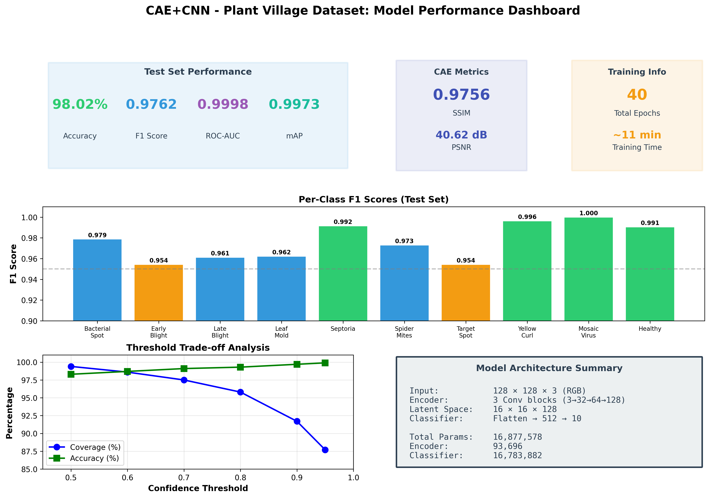
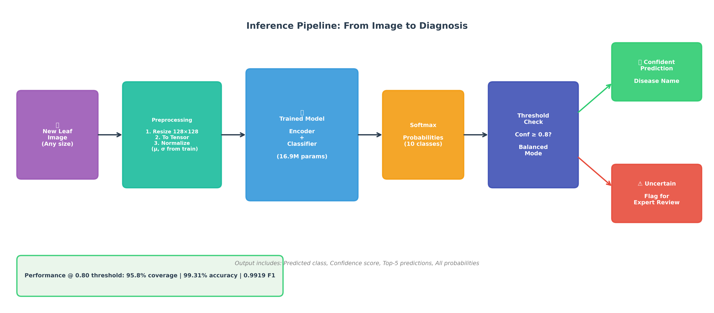

# AI-Driven Diagnostic Framework for Multi-Class Tomato Leaf Pathologies: A Dual-Stage Self-Supervised CAE-CNN Approach

<p align="center">
  
</p>

[](https://www.python.org/downloads/)
[](https://pytorch.org/)
[](LICENSE)
[](https://github.com/spMohanty/PlantVillage-Dataset)

A deep learning framework for automated tomato leaf disease classification using a dual-stage approach: **self-supervised feature learning** via Convolutional Autoencoder (CAE) followed by **supervised classification** via CNN with transfer learning.

---

## 📋 Table of Contents

- [Overview](#overview)
- [Key Results](#key-results)
- [Architecture](#architecture)
- [Dataset](#dataset)
- [Installation](#installation)
- [Project Structure](#project-structure)
- [Usage](#usage)
- [Training Pipeline](#training-pipeline)
- [Evaluation Results](#evaluation-results)
- [Inference](#inference)
- [Notebooks](#notebooks)
- [Diagrams](#diagrams)
- [Citation](#citation)
- [License](#license)

---

## 🎯 Overview

**DeepSpec-Tomato** addresses the challenge of automated plant disease detection through a novel dual-stage approach:

1. **Stage 1 - Self-Supervised Learning**: A Convolutional Autoencoder learns robust visual features through image reconstruction without requiring labels.

2. **Stage 2 - Supervised Classification**: The pre-trained encoder is transferred to a classifier and fine-tuned using a two-phase training strategy.

### Key Innovations

- **Self-supervised pre-training** eliminates dependence on large labeled datasets
- **Two-phase transfer learning** (frozen → fine-tuned) prevents catastrophic forgetting
- **Threshold optimization** enables confidence-based deployment strategies
- **Production-ready inference pipeline** with batch processing support

---

## 🏆 Key Results

<p align="center">
  
</p>

### Test Set Performance

| Metric | Value |
|--------|-------|
| **Accuracy** | 98.02% |
| **F1 Score (Macro)** | 0.9762 |
| **Precision (Macro)** | 0.9787 |
| **Recall (Macro)** | 0.9740 |
| **ROC-AUC (Micro)** | 0.9998 |
| **Mean Average Precision** | 0.9973 |

### CAE Reconstruction Quality

| Metric | Value |
|--------|-------|
| **SSIM** | 0.9756 |
| **PSNR** | 40.62 dB |

### Per-Class F1 Scores

| Disease | F1 Score |
|---------|----------|
| Tomato Mosaic Virus | **1.0000** |
| Yellow Leaf Curl Virus | **0.9963** |
| Septoria Leaf Spot | **0.9915** |
| Healthy | **0.9905** |
| Bacterial Spot | 0.9788 |
| Spider Mites | 0.9731 |
| Leaf Mold | 0.9622 |
| Late Blight | 0.9612 |
| Target Spot | 0.9544 |
| Early Blight | 0.9543 |

---

## 🏗️ Architecture

### Convolutional Autoencoder (CAE)

<p align="center">
  
</p>

```
Input: 128×128×3 RGB Image
    ↓
┌─────────────────────────────────────┐
│            ENCODER                  │
├─────────────────────────────────────┤
│ Conv2d(3→32, k=3, s=2) + BN + ReLU │  → 64×64×32
│ Conv2d(32→64, k=3, s=2) + BN + ReLU│  → 32×32×64
│ Conv2d(64→128, k=3, s=2) + BN + ReLU│ → 16×16×128
└─────────────────────────────────────┘
    ↓
┌─────────────────────────────────────┐
│         LATENT SPACE                │
│           16×16×128                 │
│        (Bottleneck)                 │
└─────────────────────────────────────┘
    ↓
┌─────────────────────────────────────┐
│            DECODER                  │
├─────────────────────────────────────┤
│ ConvT2d(128→64, k=3, s=2) + BN + ReLU│ → 32×32×64
│ ConvT2d(64→32, k=3, s=2) + BN + ReLU │ → 64×64×32
│ ConvT2d(32→3, k=3, s=2) + Sigmoid    │ → 128×128×3
└─────────────────────────────────────┘
    ↓
Output: 128×128×3 Reconstructed Image
```

**Parameters**: 187,011 (Encoder: 93,696 | Decoder: 93,315)

### CNN Classifier (Two-Phase Training)

<p align="center">
  
</p>

```
Input: 128×128×3 RGB Image
    ↓
┌─────────────────────────────────────┐
│      PRE-TRAINED ENCODER            │
│      (from CAE)                     │
├─────────────────────────────────────┤
│ Phase 1: FROZEN (LR=1e-3)           │
│ Phase 2: UNFROZEN (LR=1e-4)         │
└─────────────────────────────────────┘
    ↓
    Features: 16×16×128
    ↓
┌─────────────────────────────────────┐
│      CLASSIFICATION HEAD            │
├─────────────────────────────────────┤
│ Flatten: 32,768                     │
│ Linear(32768→512) + BN + ReLU       │
│ Dropout(0.4)                        │
│ Linear(512→10)                      │
└─────────────────────────────────────┘
    ↓
Output: 10-class probabilities
```

**Total Parameters**: 16,877,578

---

## 📊 Dataset

<p align="center">
  
</p>

We use the **PlantVillage** dataset, filtered to tomato leaves only:

| Class | Samples | Description |
|-------|---------|-------------|
| Bacterial Spot | 2,127 | Bacterial infection with dark spots |
| Early Blight | 1,000 | Fungal disease with concentric rings |
| Late Blight | 1,909 | Devastating Phytophthora infection |
| Leaf Mold | 952 | Fungal infection on leaf undersides |
| Septoria Leaf Spot | 1,771 | Circular spots with dark borders |
| Spider Mites | 1,676 | Pest damage with stippling patterns |
| Target Spot | 1,404 | Concentric rings resembling targets |
| Yellow Leaf Curl Virus | 5,357 | Viral leaf curling and yellowing |
| Tomato Mosaic Virus | 373 | Viral mottling pattern |
| Healthy | 1,591 | No disease (control) |
| **Total** | **18,160** | |

### Data Split

| Split | Samples | Percentage |
|-------|---------|------------|
| Training | 14,528 | 80% |
| Validation | 1,816 | 10% |
| Test | 1,816 | 10% |

**Stratified splitting** ensures class proportions are maintained across all splits.

---

## 🚀 Installation

### Prerequisites

- Python 3.10+
- CUDA-capable GPU (recommended)
- 8GB+ GPU memory

### Setup

```bash
# Clone the repository
git clone https://github.com/yourusername/plant-village-cae.git
cd plant-village-cae

# Create virtual environment
python -m venv venv
source venv/bin/activate  # On Windows: venv\Scripts\activate

# Install dependencies
pip install -r requirements.txt
```

### Requirements

```txt
torch>=2.0.0
torchvision>=0.15.0
numpy>=1.24.0
pandas>=2.0.0
matplotlib>=3.7.0
seaborn>=0.12.0
scikit-learn>=1.3.0
Pillow>=9.5.0
tqdm>=4.65.0
jupyter>=1.0.0
```

---

## 📁 Project Structure

```
plant-village-cae/
│
├── data/
│   ├── raw/color/                    # Original PlantVillage dataset
│   └── processed/
│       ├── tomato/                   # Tomato subset (18,160 images)
│       ├── train/                    # Training set (14,528)
│       ├── val/                      # Validation set (1,816)
│       └── test/                     # Test set (1,816)
│
├── models/
│   ├── cae_encoder.pth               # Pre-trained encoder weights
│   ├── cae_full.pth                  # Full CAE model
│   ├── classifier_final.pth          # Final classifier
│   └── production/
│       ├── model_weights.pth         # Lightweight production weights
│       ├── model_config.json         # Model configuration
│       └── inference.py              # Standalone inference script
│
├── checkpoints/
│   ├── cae_best.pth                  # Best CAE checkpoint
│   └── classifier_best.pth           # Best classifier checkpoint
│
├── config/
│   ├── dataset_config.json           # Dataset configuration
│   ├── split_metadata.json           # Split information & normalization
│   ├── cae_training_summary.json     # CAE training results
│   ├── classifier_training_summary.json
│   ├── final_evaluation_results.json # Test set results
│   └── threshold_recommendations.json
│
├── logs/
│   ├── cae_training_history.csv      # CAE training metrics
│   ├── classifier_training_history.csv
│   ├── classification_report_val.csv
│   └── classification_report_test.csv
│
├── outputs/
│   ├── fig_01-15_*.png               # Training figures
│   ├── fig_16-23_*.png               # Evaluation figures
│   └── diagram_01-08_*.png           # Architecture diagrams
│
├── notebooks/
│   ├── 1_Data_Exploration.ipynb
│   ├── 2_Data_Preprocessing.ipynb
│   ├── 3_CAE_Training.ipynb
│   ├── 4_CNN_Classifier_Training.ipynb
│   ├── 5_Threshold_Optimization_and_Evaluation.ipynb
│   ├── Inference_Notebook.ipynb
│   └── Workflow_Diagrams.ipynb
│
├── README.md
├── requirements.txt
└── LICENSE
```

---

## 💻 Usage

### Quick Inference

```python
from pathlib import Path
import torch
from torchvision import transforms
from PIL import Image

# Load model
checkpoint = torch.load('models/classifier_final.pth')
model.load_state_dict(checkpoint['model_state_dict'])
model.eval()

# Preprocessing
transform = transforms.Compose([
    transforms.Resize((128, 128)),
    transforms.ToTensor(),
    transforms.Normalize(
        mean=[0.4504, 0.4662, 0.4011],
        std=[0.1742, 0.1514, 0.1907]
    )
])

# Predict
image = Image.open('path/to/leaf.jpg').convert('RGB')
input_tensor = transform(image).unsqueeze(0)

with torch.no_grad():
    output = model(input_tensor)
    probs = torch.softmax(output, dim=1)
    predicted_class = probs.argmax().item()
    confidence = probs.max().item()

print(f"Predicted: {CLASS_NAMES[predicted_class]} ({confidence:.1%})")
```

### Command Line Inference

```bash
# Single image
python models/production/inference.py \
    --model-dir models/production \
    --image path/to/leaf.jpg

# Batch processing
python models/production/inference.py \
    --model-dir models/production \
    --folder path/to/images \
    --output results.csv
```

---

## 🔧 Training Pipeline

<p align="center">
  
</p>

### Stage 1: CAE Pre-training

```python
# Configuration
IMAGE_SIZE = 128
LATENT_CHANNELS = 128
BATCH_SIZE = 64
LEARNING_RATE = 1e-3
MAX_EPOCHS = 50
EARLY_STOPPING_PATIENCE = 7
```

**Training Command:**
```bash
jupyter notebook notebooks/3_CAE_Training.ipynb
```

**Results:**
- Best SSIM: 0.9756
- Best PSNR: 40.62 dB
- Training time: ~6 minutes

### Stage 2: Classifier Training

```python
# Phase 1: Frozen Encoder
LEARNING_RATE = 1e-3
EPOCHS = 15

# Phase 2: Fine-tuning
LEARNING_RATE = 1e-4
EPOCHS = 25
```

**Training Command:**
```bash
jupyter notebook notebooks/4_CNN_Classifier_Training.ipynb
```

**Results:**
- Phase 1 F1: 0.7711
- Phase 2 F1: 0.9774 (+26.7% improvement)
- Training time: ~6 minutes

---

## 📈 Evaluation Results

### Confusion Matrix

<p align="center">
  
</p>

### ROC Curves

<p align="center">
  
</p>

### t-SNE Feature Visualization

<p align="center">
  
</p>

### Threshold Optimization

| Threshold | Coverage | Accuracy | Use Case |
|-----------|----------|----------|----------|
| 0.50 | 99.4% | 98.3% | High recall (screening) |
| 0.80 | 95.8% | 99.3% | **Balanced (recommended)** |
| 0.95 | 87.7% | 99.9% | High precision |

---

## 🔮 Inference Pipeline

<p align="center">
  
</p>

### Features

- **Single image prediction** with confidence scores
- **Batch processing** for folder of images
- **Top-K predictions** with probability distribution
- **Threshold-based filtering** for deployment
- **CSV export** for batch results

### Deployment Recommendations

| Scenario | Threshold | Expected Accuracy |
|----------|-----------|-------------------|
| Screening (catch all) | 0.50 | 98.3% |
| General deployment | 0.80 | 99.3% |
| High-stakes decisions | 0.95 | 99.9% |

---

## 📓 Notebooks

| Notebook | Description |
|----------|-------------|
| `1_Data_Exploration.ipynb` | Dataset analysis, class distribution, sample visualization |
| `2_Data_Preprocessing.ipynb` | Stratified splitting, normalization computation |
| `3_CAE_Training.ipynb` | Self-supervised autoencoder training |
| `4_CNN_Classifier_Training.ipynb` | Two-phase transfer learning |
| `5_Threshold_Optimization_and_Evaluation.ipynb` | Final evaluation, ROC/PR curves, t-SNE |
| `Inference_Notebook.ipynb` | Production inference pipeline |
| `Workflow_Diagrams.ipynb` | Architecture and workflow visualizations |

---

## 🎨 Diagrams

All diagrams are generated programmatically and saved to `outputs/`:

| Diagram | Description |
|---------|-------------|
| `diagram_01_project_workflow.png` | Complete 4-phase project pipeline |
| `diagram_02_data_pipeline.png` | Data flow from raw to splits |
| `diagram_03_cae_architecture.png` | Encoder-Decoder architecture |
| `diagram_04_cnn_two_phase_training.png` | Frozen vs Fine-tuning phases |
| `diagram_05_training_pipeline.png` | Complete training flow |
| `diagram_06_inference_pipeline.png` | Production deployment flow |
| `diagram_07_performance_dashboard.png` | Metrics summary |
| `diagram_08_disease_classes.png` | 10-class overview |

---

## 🔬 Technical Details

### Data Augmentation (Training Only)

```python
transforms.Compose([
    transforms.Resize((128, 128)),
    transforms.RandomHorizontalFlip(p=0.5),
    transforms.RandomVerticalFlip(p=0.3),
    transforms.RandomRotation(15),
    transforms.ColorJitter(brightness=0.2, contrast=0.2),
    transforms.ToTensor(),
    transforms.Normalize(mean, std)
])
```

### Normalization Statistics (Computed from Training Set)

```python
mean = [0.4504, 0.4662, 0.4011]  # RGB
std = [0.1742, 0.1514, 0.1907]   # RGB
```

### Hardware Used

- GPU: NVIDIA GeForce RTX 5070 Ti Laptop GPU
- CUDA: 12.8
- PyTorch: 2.7.0

---

## 📚 Citation

If you use this work, please cite:

```bibtex
@software{deepspec_tomato_2025,
  author = {[Your Name]},
  title = {DeepSpec-Tomato: A Dual-Stage CAE-CNN Diagnostic Framework},
  year = {2025},
  url = {https://github.com/yourusername/plant-village-cae}
}
```

### Dataset Citation

```bibtex
@article{hughes2015plantvillage,
  title={An open access repository of images on plant health to enable 
         the development of mobile disease diagnostics},
  author={Hughes, David P and Salath{\'e}, Marcel},
  journal={arXiv preprint arXiv:1511.08060},
  year={2015}
}
```

---

## 📄 License

This project is licensed under the MIT License - see the [LICENSE](LICENSE) file for details.

---

## 🙏 Acknowledgments

- [PlantVillage Dataset](https://github.com/spMohanty/PlantVillage-Dataset) for the tomato leaf images
- PyTorch team for the deep learning framework
- Anthropic Claude for development assistance

---

<p align="center">
  <b>Built with ❤️ for sustainable agriculture</b>
</p>
